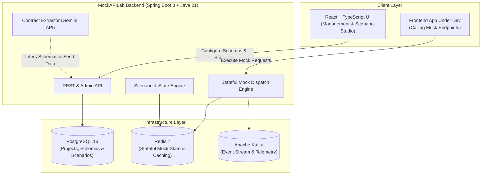

# MockAPILab

> Intelligent, stateful mock backend engine for modern frontend and full-stack development.

[](backend/)
[](frontend/)
[](docs/architecture.md)

---

## 1. What is MockAPILab?

**MockAPILab** is a developer productivity platform that transforms API contracts, OpenAPI specifications, or backend controller/model definitions into a locally runnable, realistic, and **stateful** mock backend. 

Unlike traditional static mock servers that only return fixed JSON snippets, MockAPILab maintains contextual state, simulates multi-step business workflows (e.g., Create $\rightarrow$ Update $\rightarrow$ Query $\rightarrow$ Delete), introduces controlled network latencies and failure scenarios, and accelerates schema onboarding using AI.

---

## 2. The Problem It Solves

Modern development teams frequently face blocking dependencies between frontend and backend workflows:

- **Backend Bottlenecks:** Frontend teams are delayed waiting for backend APIs to be designed, deployed, and stabilized.
- **Unrealistic Static Mocks:** Existing mocking tools return static, stateless fixtures. They fail to test real-world scenarios such as pagination state, entity mutation, conditional errors, or race conditions.
- **Contract Drift:** Hand-written mock configurations drift rapidly from changing backend specifications.
- **Manual Overhead:** Writing mock routes and state machines by hand is tedious and error-prone.

**MockAPILab bridges this gap** by automating contract ingestion (including AI-powered extraction from code snippets), compiling stateful routes, and providing isolated, persistent or ephemeral mock environments for developers and automated tests.

---

## 3. High-Level Architecture

MockAPILab is built as a clean **Modular Monolith** designed for high throughput, operational simplicity, and clear module separation.



---

## 4. Technology Stack

| Layer | Technologies | Purpose |
|---|---|---|
| **Core Backend** | Java 21, Spring Boot 3.4, Maven | Modular monolith backend runtime, REST API, mock engine |
| **Frontend** | React 18, TypeScript, Vite | Developer dashboard, schema visualizer, scenario designer |
| **Database** | PostgreSQL 16 | Relational system of record for projects, contracts, schemas |
| **State & Cache** | Redis 7 | High-speed transient state storage for dynamic mocks |
| **Event Streaming**| Apache Kafka 3.7 (KRaft) | Asynchronous invocation telemetry and event-driven mocking |
| **AI Integration** | Google Gemini API | Automated contract and schema extraction from raw source code |
| **Containers** | Docker, Docker Compose | Reproducible local and CI/CD development environment |
| **Testing** | JUnit 5, Mockito, MockMvc, Testcontainers | Rigorous automated verification |

---

## 5. Current Milestone & Status

### 📍 Milestone 1: Project Foundation (Current)
- [x] Initialized clean project repository structure (`backend/`, `frontend/`, `infrastructure/`, `docs/`).
- [x] Established Java 21 Spring Boot 3 modular monolith base.
- [x] Established base module boundaries (`auth`, `project`, `contract`, `generation`, `scenario`, `runtime`, `ai`, `common`).
- [x] Verified Spring Boot application context startup and exposed `/api/v1/status`.
- [x] Initialized React + TypeScript + Vite frontend foundation.
- [x] Configured Docker Compose infrastructure definitions for PostgreSQL, Redis, and Kafka.
- [x] Documented architectural decisions in [`docs/architecture.md`](docs/architecture.md).

---

## 6. Planned Development Phases

```
┌─────────────────────────────────────────────────────────────┐
│ Milestone 1: Project Foundation (Current)                   │
├─────────────────────────────────────────────────────────────┤
│ Milestone 2: Project & Contract Ingestion (OpenAPI Parser)  │
├─────────────────────────────────────────────────────────────┤
│ Milestone 3: Dynamic Mock Generation & Dispatch Engine      │
├─────────────────────────────────────────────────────────────┤
│ Milestone 4: Redis-Powered Stateful Scenarios & Workflows   │
├─────────────────────────────────────────────────────────────┤
│ Milestone 5: AI-Assisted Contract Extraction (Gemini API)   │
├─────────────────────────────────────────────────────────────┤
│ Milestone 6: Interactive Frontend Studio & Telemetry Stream │
└─────────────────────────────────────────────────────────────┘
```

For detailed architectural rationale and module breakdowns, see [docs/architecture.md](docs/architecture.md).

---

## 7. Quick Start (Local Development)

### Prerequisites
- **Java 21+** (JDK 21 or higher)
- **Maven 3.9+**
- **Node.js 20+** and **npm**
- **Docker & Docker Compose**

### Running the Backend
```bash
cd backend
mvn clean test
mvn spring-boot:run
```
*Health endpoint:* `http://localhost:8080/api/v1/status`

### Running the Frontend
```bash
cd frontend
npm install
npm run dev
```
*Frontend UI:* `http://localhost:5173`

### Starting Supporting Infrastructure (Optional for local dev)
```bash
docker compose -f infrastructure/docker-compose.yml up -d postgres redis kafka
```