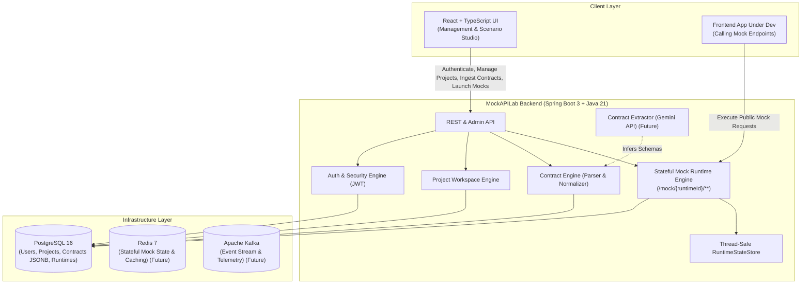

# MockAPILab

> Intelligent, stateful mock backend engine for modern frontend and full-stack development.

[](backend/)
[](frontend/)
[](docs/architecture.md)
[](backend/src/main/resources/db/migration/)
[](docs/examples/sample-users-api.yaml)
[](backend/src/main/java/com/mockapilab/modules/runtime/)

---

## 1. What is MockAPILab?

**MockAPILab** is a developer productivity platform that transforms API contracts, OpenAPI specifications, or backend controller/model definitions into a locally runnable, realistic, and **stateful** mock backend. 

Unlike traditional static mock servers that only return fixed JSON snippets, MockAPILab maintains contextual in-memory state, executes multi-step REST CRUD lifecycles (e.g., `POST` $\rightarrow$ `GET collection` $\rightarrow$ `GET item` $\rightarrow$ `PUT` $\rightarrow$ `DELETE` $\rightarrow$ `404`), validates incoming request bodies against schema rules, and isolates state per runtime instance.

---

## 2. The Problem It Solves

Modern development teams frequently face blocking dependencies between frontend and backend workflows:

- **Backend Bottlenecks:** Frontend teams are delayed waiting for backend APIs to be designed, deployed, and stabilized.
- **Unrealistic Static Mocks:** Existing mocking tools return static, stateless fixtures. They fail to test real-world scenarios such as entity mutation, schema validation failures, or resource lifecycles.
- **Contract Drift:** Hand-written mock configurations drift rapidly from changing backend specifications.
- **Manual Overhead:** Writing mock routes and state machines by hand is tedious and error-prone.

**MockAPILab bridges this gap** by compiling ingested contracts into dynamic in-process mock backends with stateful CRUD semantics and zero configuration.

---

## 3. High-Level Architecture

MockAPILab is built as a clean **Modular Monolith** designed for high throughput, operational simplicity, and clear module separation.



---

## 4. Stateful Mock Runtime Engine (Milestone 4)

MockAPILab provides an in-process, high-throughput dynamic mock execution gateway:

```
                          +------------------------+
                          ¦   NormalizedContract   ¦
                          +------------------------+
                                      ¦ RouteCompiler
                                      ?
                          +------------------------+
                          ¦     CompiledRoutes     ¦
                          +------------------------+
                                      ¦
HTTP Request --> /mock/{runtimeId}/** ¦ (No JWT required)
                                      ?
                          +------------------------+
                          ¦  MockRequestDispatcher ¦
                          +------------------------+
                                ¦            ¦
            Schema Validation --¦            +-- State Store Mutation
            (MockRequestValidator)           ¦   (RuntimeStateStore)
                                             ?
                                  [201 Created / 200 OK / 404]
```

### Key Capabilities
- **Public Dynamic Gateway:** Accepts requests under `/mock/{runtimeId}/**` without requiring JWT authentication.
- **Route Compilation:** Compiles paths (e.g. `/pets/{petId}`, `/users/{userId}/orders/{orderId}`) into regex matchers with specificity ordering.
- **Request Validation:** Enforces required fields, primitive types, and enum constants against `NormalizedSchema`, returning structured `400 Bad Request` upon failure.
- **Stateful REST Operations:**
  - `POST /collection`: Generates/preserves ID, inserts entity into runtime state, returns `201 Created`.
  - `GET /collection`: Returns list of stored entities (with automatic schema-driven mock seeding if empty).
  - `GET /collection/{id}`: Looks up entity by ID, returns `200 OK` or `404 Not Found`.
  - `PUT/PATCH /collection/{id}`: Merges/updates stored entity, returns `200 OK` or `404 Not Found`.
  - `DELETE /collection/{id}`: Removes entity, returns `204 No Content` / `200 OK`; subsequent `GET` returns `404`.
  - `Generic / RPC endpoints`: Returns deterministic mock response conforming to `NormalizedResponse`.
- **Runtime State Isolation:** Thread-safe state store partitioned by `runtimeId`. Two runtimes created from the same contract never share state.

---

## 5. Available REST API Endpoints

| Category | Method | Endpoint | Access | Description |
|---|---|---|---|---|
| **Health** | `GET` | `/api/v1/status` | Public | System status and service health |
| **Docs** | `GET` | `/swagger-ui.html` | Public | Interactive Swagger API Documentation |
| **Docs** | `GET` | `/v3/api-docs` | Public | OpenAPI specification for MockAPILab |
| **Auth** | `POST` | `/api/v1/auth/register` | Public | Register a new user and receive a JWT token |
| **Auth** | `POST` | `/api/v1/auth/login` | Public | Authenticate user credentials and receive a JWT token |
| **Auth** | `GET` | `/api/v1/auth/me` | Protected | Retrieve authenticated user profile |
| **Projects** | `POST` | `/api/v1/projects` | Protected | Create a new project workspace (owner assigned) |
| **Projects** | `GET` | `/api/v1/projects` | Protected | List all project workspaces owned by caller |
| **Projects** | `GET` | `/api/v1/projects/{id}` | Protected | Retrieve project workspace details (owner only) |
| **Projects** | `PUT` | `/api/v1/projects/{id}` | Protected | Update project name / description (owner only) |
| **Projects** | `DELETE` | `/api/v1/projects/{id}` | Protected | Delete project workspace (owner only) |
| **Contracts**| `POST` | `/api/v1/projects/{projectId}/contracts` | Protected | Ingest OpenAPI 3.x contract & create version 1 |
| **Contracts**| `GET` | `/api/v1/projects/{projectId}/contracts` | Protected | List contracts belonging to project (owner only) |
| **Contracts**| `GET` | `/api/v1/projects/{projectId}/contracts/{contractId}` | Protected | Get contract details & latest version stats |
| **Contracts**| `GET` | `/api/v1/projects/{projectId}/contracts/{contractId}/versions` | Protected | List all versions for a contract |
| **Contracts**| `GET` | `/api/v1/projects/{projectId}/contracts/{contractId}/versions/{versionNumber}` | Protected | Retrieve full `NormalizedContract` JSON definition |
| **Runtimes** | `POST` | `/api/v1/projects/{projectId}/contracts/{contractId}/versions/{versionNumber}/runtime` | Protected | Start in-process stateful mock runtime |
| **Runtimes** | `GET` | `/api/v1/projects/{projectId}/runtimes` | Protected | List all mock runtimes in project |
| **Runtimes** | `GET` | `/api/v1/projects/{projectId}/runtimes/{runtimeId}` | Protected | Get runtime details and status |
| **Runtimes** | `GET` | `/api/v1/projects/{projectId}/runtimes/{runtimeId}/status` | Protected | Get live runtime statistics, entities count & uptime |
| **Runtimes** | `POST` | `/api/v1/projects/{projectId}/runtimes/{runtimeId}/stop` | Protected | Stop active mock runtime |
| **Runtimes** | `DELETE` | `/api/v1/projects/{projectId}/runtimes/{runtimeId}` | Protected | Stop, clear state, and delete runtime |
| **Mock Gateway** | `ALL` | `/mock/{runtimeId}/**` | **Public** | **Execute dynamic stateful mock API calls** |

---

## 6. Technology Stack

| Layer | Technologies | Purpose |
|---|---|---|
| **Core Backend** | Java 21, Spring Boot 3.4, Maven | Modular monolith backend runtime, REST API, mock engine |
| **Security & Auth** | Spring Security 6, JJWT 0.12, BCrypt | Stateless JWT authentication, role & ownership authorization |
| **Contract Engine** | SwaggerParser 2.1, Jackson YAML, SpringDoc OpenAPI | OpenAPI 3.x parser, validation, schema normalizer, Swagger UI |
| **Mock Runtime** | Dynamic Regex Compiler, Schema Validator | Stateful REST simulation, isolated in-memory store |
| **Database & ORM** | PostgreSQL 16, Spring Data JPA, Hibernate (JSONB) | Relational persistence + JSONB normalized contract snapshots |
| **Schema Migrations**| Flyway Migration Engine | Deterministic, version-controlled database migrations (`V1`, `V2`, `V3`) |
| **Frontend** | React 18, TypeScript, Vite | Developer dashboard, contract ingestion, runtime control & mock tester |
| **Containers** | Docker, Docker Compose | Reproducible local and CI/CD development environment |
| **Testing** | JUnit 5, Mockito, MockMvc, H2 | Comprehensive automated testing suite (41 tests) |

---

## 7. Current Milestone & Status

### ?? Milestone 1: Project Foundation (Complete)
- [x] Initialized clean project repository structure (`backend/`, `frontend/`, `infrastructure/`, `docs/`).
- [x] Established Java 21 Spring Boot 3 modular monolith base and package structure.
- [x] Configured Docker Compose infrastructure definitions for PostgreSQL, Redis, and Kafka.

### ?? Milestone 2: Identity + Project Management (Complete)
- [x] Integrated PostgreSQL with Spring Data JPA (`User` and `Project` entities with UUIDs).
- [x] Configured Flyway database migrations (`V1__init_users_and_projects.sql`).
- [x] Implemented stateless JWT authentication and BCrypt password hashing (`/register`, `/login`, `/me`).
- [x] Implemented project workspace CRUD with strict server-side owner isolation.

### ?? Milestone 3: Contract Ingestion + Normalized Contract Engine (Complete)
- [x] Designed canonical `NormalizedContract` model (`endpoints`, `schemas`, `parameters`, `requestBody`, `responses`).
- [x] Implemented OpenAPI 3.x Parser supporting JSON & YAML, local `$ref` resolution, enums, and nested types.
- [x] Created Flyway migration `V2__init_contracts_and_versions.sql` storing normalized definitions in `JSONB`.
- [x] Built contract ingestion and versioned retrieval REST APIs (`/api/v1/projects/{projectId}/contracts/**`).

### ?? Milestone 4: Stateful Mock Runtime Engine (Complete)
- [x] Created Flyway migration `V3__init_runtimes.sql` for runtime persistence and lifecycle tracking.
- [x] Implemented route compiler with regex pattern extraction, specificity scoring, and REST operation inference.
- [x] Built schema-driven request validator checking required fields, JSON structures, primitive types, and enums.
- [x] Implemented thread-safe `RuntimeStateStore` providing isolated in-memory state per runtime.
- [x] Built full stateful CRUD semantics (POST creates, GET lists, GET by ID retrieves, PUT updates, DELETE removes and produces 404).
- [x] Built public `/mock/{runtimeId}/**` gateway allowing unauthenticated mock traffic.
- [x] Built runtime management APIs (`/runtime`, `/status`, `/stop`, `DELETE`) with owner verification.
- [x] Integrated runtime control panel & live mock tester in React frontend.
- [x] Added comprehensive automated integration test suite (41 tests total).

---

## 8. Planned Development Phases

```
+-------------------------------------------------------------+
¦ Milestone 1: Project Foundation (Complete)                  ¦
+-------------------------------------------------------------¦
¦ Milestone 2: Identity + Project Management (Complete)       ¦
+-------------------------------------------------------------¦
¦ Milestone 3: Contract Ingestion & Normalization (Complete)  ¦
+-------------------------------------------------------------¦
¦ Milestone 4: Stateful Mock Runtime Engine (Complete)        ¦
+-------------------------------------------------------------¦
¦ Milestone 5: AI-Assisted Contract Extraction (Gemini API)   ¦
+-------------------------------------------------------------¦
¦ Milestone 6: Interactive Frontend Studio & Telemetry Stream ¦
+-------------------------------------------------------------+
```

---

## 9. Quick Start (Local Development)

### Prerequisites
- **Java 21+** (JDK 21 or higher)
- **Maven 3.9+**
- **Node.js 20+** and **npm**
- **Docker & Docker Compose** (optional for local database container)

### Environment Configuration
Copy the template environment file:
```bash
cp .env.example .env
```
Ensure `JWT_SECRET` is set to a secure string of at least 32 characters.

### Running Backend Tests
```bash
cd backend
mvn clean test
```

### Running the Backend Service
Start the PostgreSQL container:
```bash
docker compose -f infrastructure/docker-compose.yml up -d postgres
```
Run the Spring Boot application:
```bash
cd backend
mvn spring-boot:run
```
- Health endpoint: `http://localhost:8080/api/v1/status`
- Swagger UI: `http://localhost:8080/swagger-ui.html`

### Running the Frontend
```bash
cd frontend
npm install
npm run dev
```
- Frontend UI: `http://localhost:5173`
