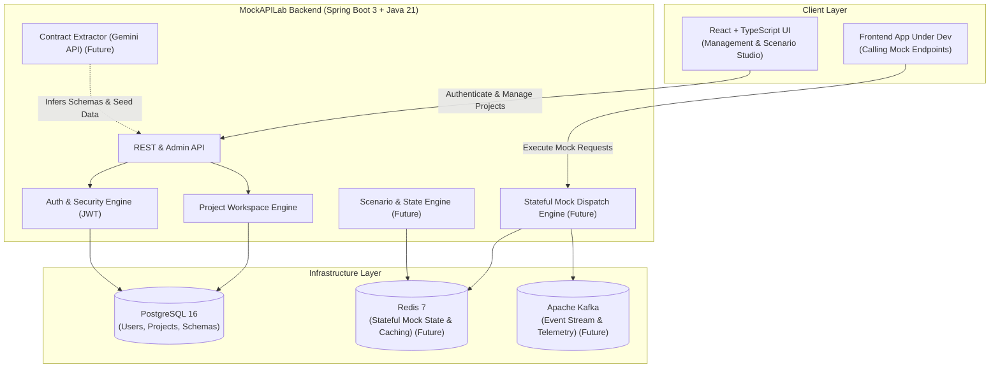

# MockAPILab

> Intelligent, stateful mock backend engine for modern frontend and full-stack development.

[](backend/)
[](frontend/)
[](docs/architecture.md)
[](backend/src/main/resources/db/migration/)

---

## 1. What is MockAPILab?

**MockAPILab** is a developer productivity platform that transforms API contracts, OpenAPI specifications, or backend controller/model definitions into a locally runnable, realistic, and **stateful** mock backend. 

Unlike traditional static mock servers that only return fixed JSON snippets, MockAPILab maintains contextual state, simulates multi-step business workflows (e.g., Create $\rightarrow$ Update $\rightarrow$ Query $\rightarrow$ Delete), introduces controlled network latencies and failure scenarios, and accelerates schema onboarding using AI.

---

## 2. The Problem It Solves

Modern development teams frequently face blocking dependencies between frontend and backend workflows:

- **Backend Bottlenecks:** Frontend teams are delayed waiting for backend APIs to be designed, deployed, and stabilized.
- **Unrealistic Static Mocks:** Existing mocking tools return static, stateless fixtures. They fail to test real-world scenarios such as pagination state, entity mutation, conditional errors, or race conditions.
- **Contract Drift:** Hand-written mock configurations drift rapidly from changing backend specifications.
- **Manual Overhead:** Writing mock routes and state machines by hand is tedious and error-prone.

**MockAPILab bridges this gap** by automating contract ingestion (including AI-powered extraction from code snippets), compiling stateful routes, and providing isolated, persistent or ephemeral mock environments for developers and automated tests.

---

## 3. High-Level Architecture

MockAPILab is built as a clean **Modular Monolith** designed for high throughput, operational simplicity, and clear module separation.



---

## 4. Available REST API Endpoints (Milestone 2)

| Method | Endpoint | Access | Description |
|---|---|---|---|
| `GET` | `/api/v1/status` | Public | System status and service health |
| `POST` | `/api/v1/auth/register` | Public | Register a new user and receive a JWT token |
| `POST` | `/api/v1/auth/login` | Public | Authenticate user credentials and receive a JWT token |
| `GET` | `/api/v1/auth/me` | Protected | Retrieve authenticated user profile |
| `POST` | `/api/v1/projects` | Protected | Create a new project workspace (authenticated user becomes owner) |
| `GET` | `/api/v1/projects` | Protected | List all project workspaces owned by the authenticated user |
| `GET` | `/api/v1/projects/{id}` | Protected | Retrieve project workspace details (owner only) |
| `PUT` | `/api/v1/projects/{id}` | Protected | Update project name / description (owner only) |
| `DELETE` | `/api/v1/projects/{id}` | Protected | Delete project workspace (owner only) |

> **Security Note:** All protected endpoints require a valid Bearer token in the `Authorization` header: `Authorization: Bearer <jwt_token>`. Project access is strictly isolated per owner on the server side (attempting to access another user's project returns `403 Forbidden`).

---

## 5. Technology Stack

| Layer | Technologies | Purpose |
|---|---|---|
| **Core Backend** | Java 21, Spring Boot 3.4, Maven | Modular monolith backend runtime, REST API, mock engine |
| **Security & Auth** | Spring Security 6, JJWT 0.12, BCrypt | Stateless JWT authentication, role & ownership authorization |
| **Database & ORM** | PostgreSQL 16, Spring Data JPA, Hibernate | Relational persistence for users, projects, contracts |
| **Schema Migrations**| Flyway Migration Engine | Deterministic, version-controlled database migrations |
| **Frontend** | React 18, TypeScript, Vite | Developer dashboard, schema visualizer, scenario designer |
| **State & Cache** | Redis 7 (Planned M4) | High-speed transient state storage for dynamic mocks |
| **Event Streaming**| Apache Kafka 3.7 (KRaft) (Planned M4/M6) | Asynchronous invocation telemetry and event-driven mocking |
| **AI Integration** | Google Gemini API (Planned M5) | Automated contract and schema extraction from raw source code |
| **Containers** | Docker, Docker Compose | Reproducible local and CI/CD development environment |
| **Testing** | JUnit 5, Mockito, MockMvc, H2 | Comprehensive automated testing suite |

---

## 6. Current Milestone & Status

### 📍 Milestone 1: Project Foundation (Complete)
- [x] Initialized clean project repository structure (`backend/`, `frontend/`, `infrastructure/`, `docs/`).
- [x] Established Java 21 Spring Boot 3 modular monolith base and package structure.
- [x] Configured Docker Compose infrastructure definitions for PostgreSQL, Redis, and Kafka.

### 📍 Milestone 2: Identity + Project Management (Complete)
- [x] Integrated PostgreSQL with Spring Data JPA (`User` and `Project` entities with UUIDs).
- [x] Configured Flyway database migrations (`V1__init_users_and_projects.sql`).
- [x] Implemented stateless JWT authentication and BCrypt password hashing (`/register`, `/login`, `/me`).
- [x] Implemented project workspace CRUD with strict server-side owner isolation.
- [x] Standardized API response envelope and error handling (400, 401, 403, 404, 409, 500).
- [x] Built comprehensive automated integration test suite (14 tests covering auth, security, and project isolation).

---

## 7. Planned Development Phases

```
┌─────────────────────────────────────────────────────────────┐
│ Milestone 1: Project Foundation (Complete)                  │
├─────────────────────────────────────────────────────────────┤
│ Milestone 2: Identity + Project Management (Complete)       │
├─────────────────────────────────────────────────────────────┤
│ Milestone 3: Project & Contract Ingestion (OpenAPI Parser)  │
├─────────────────────────────────────────────────────────────┤
│ Milestone 4: Dynamic Mock Generation & Redis Stateful State │
├─────────────────────────────────────────────────────────────┤
│ Milestone 5: AI-Assisted Contract Extraction (Gemini API)   │
├─────────────────────────────────────────────────────────────┤
│ Milestone 6: Interactive Frontend Studio & Telemetry Stream │
└─────────────────────────────────────────────────────────────┘
```

For detailed architectural rationale and module breakdowns, see [docs/architecture.md](docs/architecture.md).

---

## 8. Quick Start (Local Development)

### Prerequisites
- **Java 21+** (JDK 21 or higher)
- **Maven 3.9+**
- **Node.js 20+** and **npm**
- **Docker & Docker Compose** (optional for local database container)

### Environment Configuration
Copy the template environment file:
```bash
cp .env.example .env
```
Ensure `JWT_SECRET` is set to a secure string of at least 32 characters.

### Running Backend Tests
```bash
cd backend
mvn clean test
```

### Running the Backend Service
Start the PostgreSQL container:
```bash
docker compose -f infrastructure/docker-compose.yml up -d postgres
```
Run the Spring Boot application:
```bash
cd backend
mvn spring-boot:run
```
*Health endpoint:* `http://localhost:8080/api/v1/status`

### Running the Frontend
```bash
cd frontend
npm install
npm run dev
```
*Frontend UI:* `http://localhost:5173`