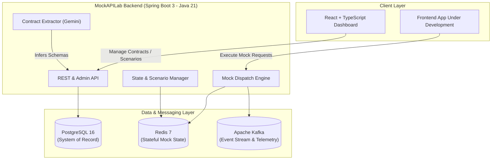

# MockAPILab — Architecture & Design Decisions

This document outlines the architectural principles, technology choices, and component responsibilities for **MockAPILab**.

---

## 1. Architectural Philosophy: Modular Monolith

MockAPILab is intentionally structured as a **Modular Monolith** rather than a distributed set of microservices.

### Why a Modular Monolith?
- **Domain Cohesion & Velocity:** At this stage of development, domain boundaries (contracts, state machines, scenarios, runtime dispatch) benefit from compile-time type safety, shared memory calls, and single-deployment coordination.
- **Operational Simplicity:** Avoids the overhead of service meshes, distributed tracing, network latency between internal components, and multi-service deployment synchronization.
- **Strict Boundary Enforcement:** Modules communicate via clean interfaces/DTOs within `com.mockapilab.modules.*`. When a module (e.g., dynamic runtime dispatch) warrants independent scaling in the future, its clear package boundaries will make extraction straightforward.

```
com.mockapilab
├── common/             # Cross-cutting: config, web exceptions, API envelopes
└── modules/
    ├── auth/           # Identity, API keys, access control
    ├── project/        # Workspace and environment boundaries
    ├── contract/       # OpenAPI/Swagger, JSON Schema, controller AST parsers
    ├── generation/     # Deterministic and random mock payload generators
    ├── scenario/       # Stateful workflows, sequences, and rule conditions
    ├── runtime/        # High-throughput mock HTTP request matching engine
    └── ai/             # Gemini-assisted schema ingestion & contract extraction
```

---

## 2. Technology Stack & Component Responsibilities



---

## 3. Detailed Component Roles

### 3.1 Spring Boot 3 + Java 21 (Core Backend)
- **Role:** High-performance, type-safe application framework serving both the configuration API and the high-throughput mock request dispatcher.
- **Why Java 21 & Spring Boot:**
  - Modern Java features (Virtual Threads / Project Loom for handling high-concurrency mock traffic, Records for immutable DTOs, Pattern Matching).
  - Robust ecosystem for contract parsing, schema validation, and enterprise-grade testing.
  - Native integration capabilities for SQL, Redis, and Kafka.

### 3.2 PostgreSQL (System of Record)
- **Role:** Persistent relational data store.
- **Responsibilities:**
  - Project and workspace configurations.
  - Imported API contracts, parsed endpoint schemas, route definitions.
  - Configured stateful scenarios, failure rules, latency profiles.
  - User and team permissions (future).

### 3.3 Redis (Runtime State Machine & Ephemeral Store)
- **Role:** Ultra-low latency, in-memory data store for live mock interactions.
- **Responsibilities:**
  - Maintaining transient entity states during scenario runs (e.g. `POST /cart/items` modifies state which `GET /cart` reflects).
  - Session-isolated mock states (allowing multiple developers to test against the same mock backend independently).
  - Token-bucket rate limiting and temporary chaos injection flags.

### 3.4 Apache Kafka (Event Streaming & Telemetry)
- **Role:** Asynchronous event bus and telemetry stream.
- **Responsibilities:**
  - Emitting mock invocation events and audit logs without degrading mock response latency.
  - Simulating asynchronous webhook delivery and event-driven backend workflows.
  - Feeding live traffic analytics into the frontend dashboard.

### 3.5 Gemini AI (AI-Assisted Contract Extraction Layer)
- **Role:** Input acceleration and schema inference.
- **Architectural Boundary (Crucial Design Rule):**
  - **AI is NOT the core runtime.** The mock request/response dispatch engine is deterministic, fast, and executed entirely in code.
  - **AI is an extraction and synthesis assistant:** It parses unformatted backend controller files, unstructured API documentation, or code snippets to automatically generate OpenAPI contracts and realistic seed data schemas.

### 3.6 React + TypeScript + Vite (Frontend Application)
- **Role:** Intuitive, responsive web workspace for developers and QA engineers.
- **Responsibilities:**
  - Uploading contracts (OpenAPI files, controller snippets).
  - Inspecting and editing generated mock routes and schemas.
  - Visual scenario designer (graphing state transitions and conditional responses).
  - Real-time mock traffic logger and state inspector.

---

## 4. Architectural Invariants
1. **Determinism over Hallucination:** Runtime mock responses must follow user-defined or schema-derived rules deterministically.
2. **Zero Hardcoded Secrets:** All credentials, keys, and environment variables are strictly externalized.
3. **Module Independence:** Business modules in the backend must avoid circular dependencies and communicate via designated service interfaces.
