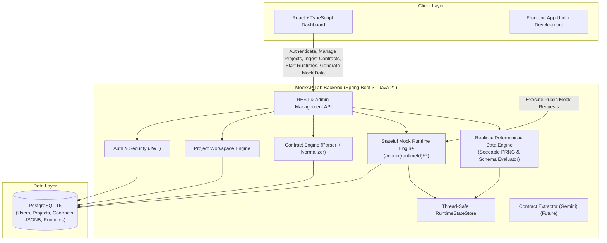

# MockAPILab — Architecture & Design Decisions

This document outlines the architectural principles, technology choices, and component responsibilities for **MockAPILab**.

---

## 1. Architectural Philosophy: Modular Monolith

MockAPILab is intentionally structured as a **Modular Monolith** rather than a distributed set of microservices.

### Why a Modular Monolith?
- **Domain Cohesion & Velocity:** Domain boundaries (identity, projects, contracts, state machines, scenarios, runtime dispatch, data generation) benefit from compile-time type safety, shared memory calls, and single-deployment coordination.
- **Operational Simplicity:** Avoids the overhead of service meshes, distributed tracing, network latency between internal components, and multi-service deployment synchronization.
- **Strict Boundary Enforcement:** Modules communicate via clean interfaces/DTOs within `com.mockapilab.modules.*`. When a module warrants independent scaling in the future, its clear package boundaries make extraction straightforward.

```
com.mockapilab
+-- common/             # Cross-cutting: web exceptions, API envelopes, CORS, OpenAPI configuration
+-- modules/
    +-- auth/           # Identity, JWT issuance, password hashing, UserPrincipal (M2)
    +-- project/        # Workspace boundaries & owner isolation (M2)
    +-- contract/       # OpenAPI/Swagger parser, Normalized Contract Model, JSONB persistence (M3)
    +-- runtime/        # Stateful Mock Runtime Engine (M4)
    ¦   +-- controller/ # Public mock gateway (/mock/{runtimeId}/**) & runtime management
    ¦   +-- engine/     # Route compiler, regex matching, request validator, dispatcher
    ¦   +-- state/      # Thread-safe isolated in-memory state store
    ¦   +-- generation/ # Realistic deterministic data generation engine (M5)
    +-- scenario/       # Stateful workflows, sequences, and rule conditions (Future)
    +-- ai/             # Gemini-assisted schema ingestion & contract extraction (Future)
```

---

## 2. Technology Stack & Component Responsibilities



---

## 3. Normalized Contract Architecture (Milestone 3 Core)

### 3.1 The Canonical Normalized Model Principle
Downstream systems (mock runtime, dynamic data generator, scenario engine, contract diffing) must **never** depend directly on external OpenAPI formats.

All incoming API specifications are transformed into a unified **`NormalizedContract`**:

```
OpenAPI 3.x (JSON/YAML) --+
                          ¦
Spring/Express AST + AI --+--> [OpenApi / AST Parser] --> NormalizedContract --> JSONB Storage
                          ¦                                        ¦
Natural Language Specs ---+                                        +--> Dynamic Mock Engine (M4)
                                                                   +--> Deterministic Data Engine (M5)
                                                                   +--> Stateful Scenarios (Future)
                                                                   +--> Contract Diffing (Future)
```

### 3.2 Normalized Contract Structure
The normalized model (`com.mockapilab.modules.contract.model.normalized`) encapsulates:
- **`ContractMetadata`:** Title, description, version, canonical format version.
- **`NormalizedEndpoint`:** Path, HTTP method, summary, description, operationId, normalized parameters, request body, and response definitions.
- **`NormalizedParameter`:** Location (`PATH`, `QUERY`, `HEADER`, `COOKIE`), name, required flag, description, and schema.
- **`NormalizedRequestBody` & `NormalizedResponse`:** Status codes, descriptions, media type mappings (e.g. `application/json`), header specifications.
- **`NormalizedSchema`:** Type (`string`, `integer`, `number`, `boolean`, `array`, `object`), format (`uuid`, `email`, `date-time`, etc.), properties, required properties, array items, enum constants, nullable flags, examples, default values, minimum, maximum, minLength, maxLength, pattern, and component references (`$ref`).

---

## 4. Stateful Mock Runtime Engine (Milestone 4 Core)

### 4.1 In-Process Dynamic Dispatch Architecture
Rather than provisioning separate OS processes or Docker containers per mock, MockAPILab hosts dynamic mock backends in-process:
- **Public Gateway:** Intercepts `/mock/{runtimeId}/**` without requiring JWT tokens.
- **Route Compilation:** `RouteCompiler` compiles `NormalizedContract` paths (e.g. `/pets/{petId}`) into prioritized regex matchers with specificity weighting (exact paths prioritized over parameter variables).
- **Request Validation:** `MockRequestValidator` validates incoming JSON payloads against schema rules (required fields, primitive type checks, enum constraints) returning `400 Bad Request` with structured error details upon violation.
- **Stateful REST Semantics:**
  - `POST /collection`: Generates/preserves ID, inserts entity into runtime collection state, returns `201 Created`.
  - `GET /collection`: Returns current stored entities (returns empty `[]` when no entities exist). **Never silently mutates state**.
  - `GET /collection/{id}`: Looks up entity by ID, returns `200 OK` or `404 Not Found`.
  - `PUT/PATCH /collection/{id}`: Merges/updates stored entity, returns `200 OK` or `404 Not Found`.
  - `DELETE /collection/{id}`: Removes entity, returns `204 No Content` / `200 OK`; subsequent `GET` returns `404`.
  - `Generic / RPC endpoints`: Returns deterministic mock response conforming to `NormalizedResponse`.

### 4.2 State Storage & Isolation
- `RuntimeStateStore` abstracts state storage per `runtimeId` and collection path.
- `InMemoryRuntimeStateStore` provides thread-safe partitioned storage using `ConcurrentHashMap` and synchronized `LinkedHashMap` to preserve insertion order.
- Each runtime instance is strictly isolated: mutations in Runtime A do not affect Runtime B.

---

## 5. Realistic Deterministic Data Engine (Milestone 5 Core)

### 5.1 Architecture & Separation of Concerns
The data generation engine (`com.mockapilab.modules.runtime.generation`) is decoupled from HTTP dispatching:

```
com.mockapilab.modules.runtime.generation/
+-- MockDataGenerator.java          # Primary facade interface
+-- DefaultMockDataGenerator.java   # Coordinates schema evaluation & collection generation
+-- SchemaDataGenerator.java        # Core recursive schema evaluator
+-- DataGenerationContext.java      # State context (seed, depth, path, cycle detection, array size)
+-- GenerationSeed.java             # PRNG state with deterministic branching
+-- generators/
    +-- StringValueGenerator.java   # Realistic names, emails, UUIDs, addresses, cities, phone numbers
    +-- NumberValueGenerator.java   # Integers, floats, doubles with property heuristics and min/max bounds
    +-- BooleanValueGenerator.java  # Deterministic booleans
    +-- DateTimeValueGenerator.java # Valid ISO-8601 timestamps and calendar dates
    +-- CollectionValueGenerator.java # Nested objects and arrays of configurable size
```

### 5.2 Determinism & Seed Reproducibility
- **Invariant:** Same seed + same schema + same property path = identical generated output across executions.
- **Seed Branching:** `GenerationSeed.branch(propertyKey)` creates isolated child seeds for sub-properties, guaranteeing that property re-ordering in schemas does not perturb other fields' random streams.
- **Explicit Seed Exposure:** If a seed is not provided by the caller in `GenerateDataRequest`, a seed is generated once and returned in `GenerateDataResponse.seed` to enable exact future reproducibility.

### 5.3 Priority Evaluation Order
Values are evaluated according to a strict priority hierarchy:
$$\text{Explicit Example} > \text{Default Value} > \text{Enum Constants} > \text{Generated Value}$$
- When multiple `enumConstants` are defined, values are chosen deterministically based on the seed rather than statically picking the first item.

### 5.4 Realistic Local Curated Datasets
Data generation requires **zero external AI or online API dependencies**. A rich curated local dataset provides:
- Human names (first/last)
- Email addresses matched to generated names
- Extensible locale-friendly phone numbers (defaulting to India `+91-XXXXXXXXXX` format)
- Geographic entities (cities, countries, street addresses, postal codes)
- Companies, domains, departments, and roles
- Numeric range heuristics (`age`, `price`, `rating`, `port`, `count`) bound to OpenAPI `minimum`/`maximum` constraints.

### 5.5 Explicit Collection Population API
- Endpoint: `POST /api/v1/projects/{projectId}/runtimes/{runtimeId}/data/generate`
- Populates `RuntimeStateStore` with $N$ realistic entities without hiding mutations in `GET` requests.

---

## 6. Architectural Decision Records (ADRs)

### 6.1 Stateless JWT Authentication (ADR-001)
Stateless HMAC-SHA256 tokens for identity and workspace authorization.

### 6.2 Strong Password Hashing (ADR-002)
BCrypt with salting (`BCryptPasswordEncoder`).

### 6.3 Strict DTO Boundaries (ADR-003)
All controller APIs expose and consume Java Record DTOs.

### 6.4 Server-Side Workspace & Contract Isolation (ADR-004)
All project, contract, and runtime management queries verify project ownership on the server side (`project.owner.id == currentPrincipal.id`).

### 6.5 Flyway Version-Controlled Migrations (ADR-005)
Flyway scripts (`V1__...`, `V2__...`, `V3__...`) manage all schema evolution with `hibernate.ddl-auto=validate`.

### 6.6 Dedicated OpenAPI Parser & Reference Resolver (ADR-006)
`OpenApiContractParser` encapsulates SwaggerParser, validates OpenAPI 3.x compliance, resolves local `$ref` pointers, and isolates the rest of the application from Swagger/OpenAPI internal classes.

### 6.7 In-Process Stateful Mock Runtime Engine (ADR-007)
Dynamic mock request dispatching via Spring MVC wildcards (`/mock/{runtimeId}/**`) backed by in-memory route compilation and partitioned state store.

### 6.8 Decoupled Deterministic Data Generation Engine (ADR-008)
- **Decision:** Dedicated `generation/` subsystem using seedable PRNGs, schema heuristics, and curated datasets without online dependencies or hidden GET mutations.
- **Rationale:** Ensures offline stability, reproducible test fixtures, fast generation throughput, and clean REST semantics.

---

## 7. Architectural Invariants
1. **Determinism over Hallucination:** Runtime mock responses and data generation must strictly follow schema rules deterministically.
2. **Zero Hidden State Mutations:** Read operations (`GET`) never mutate runtime state; population is performed via explicit REST APIs or stateful mutations (`POST`, `PUT`).
3. **Zero Hardcoded Secrets:** All credentials, tokens, and database secrets are externalized via environment variables.
4. **Module Independence:** Business modules communicate through designated services and DTOs without cyclic dependencies.
