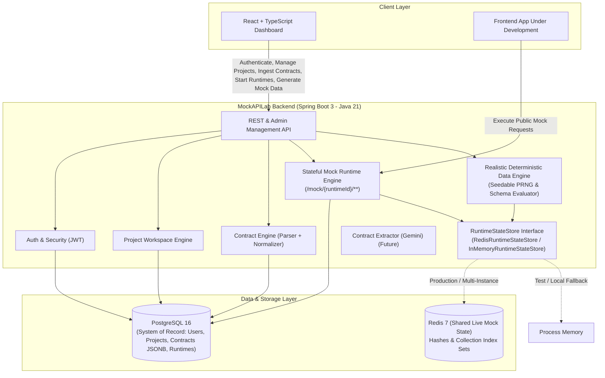

# MockAPILab - Architecture & Design Decisions

This document outlines the architectural principles, technology choices, and component responsibilities for **MockAPILab**.

---

## 1. Architectural Philosophy: Modular Monolith

MockAPILab is intentionally structured as a **Modular Monolith** rather than a distributed set of microservices.

### Why a Modular Monolith?
- **Domain Cohesion & Velocity:** Domain boundaries (identity, projects, contracts, state machines, scenarios, runtime dispatch, data generation, state management) benefit from compile-time type safety, shared memory calls, and single-deployment coordination.
- **Operational Simplicity:** Avoids the overhead of service meshes, distributed tracing, network latency between internal components, and multi-service deployment synchronization.
- **Strict Boundary Enforcement:** Modules communicate via clean interfaces/DTOs within `com.mockapilab.modules.*`. When a module warrants independent scaling in the future, its clear package boundaries make extraction straightforward.

```
com.mockapilab
+-- common/             # Cross-cutting: web exceptions, API envelopes, CORS, OpenAPI configuration
+-- modules/
    +-- auth/           # Identity, JWT issuance, password hashing, UserPrincipal (M2)
    +-- project/        # Workspace boundaries & owner isolation (M2)
    +-- contract/       # OpenAPI/Swagger parser, Normalized Contract Model, JSONB persistence (M3)
    +-- runtime/        # Stateful Mock Runtime Engine (M4)
        +-- controller/ # Public mock gateway (/mock/{runtimeId}/**) & runtime management
        +-- engine/     # Route compiler, regex matching, request validator, dispatcher
        +-- state/      # Runtime state store abstraction, Redis & In-Memory implementations (M6)
        +-- config/     # Redis & runtime bean configuration (M6)
        +-- generation/ # Realistic deterministic data generation engine (M5)
    +-- scenario/       # Stateful workflows, sequences, and rule conditions (Future)
    +-- ai/             # Gemini-assisted schema ingestion & contract extraction (Future)
```

---

## 2. Technology Stack & Component Responsibilities



### Component Breakdown
| Layer / Component | Technology | Primary Responsibility |
| :--- | :--- | :--- |
| **Client Frontend** | React 18, TypeScript, Vite, TailwindCSS | User dashboard for authentication, project/contract management, runtime lifecycle, and data generation. |
| **Backend Core** | Java 21, Spring Boot 3.3.x | Modular monolith hosting REST management APIs, route compilers, dispatch engine, and state machines. |
| **Security & Identity** | Spring Security, jjwt (HMAC-SHA256), BCrypt | Stateless JWT verification, password hashing, workspace ownership enforcement. |
| **Contract Ingestion** | SwaggerParser 2.1.x, Jackson | OpenAPI 3.x document parsing, dereferencing, normalization into canonical internal AST. |
| **System of Record** | PostgreSQL 16, Flyway, Spring Data JPA | Relational storage for users, projects, normalized contracts (JSONB), and runtime definitions. |
| **Live Runtime State** | Redis 7, Spring Data Redis (`StringRedisTemplate`) | Shared, partitioned mutable mock entity store across backend instances with atomic hashing and collection indexing. |
| **Fallback State** | In-Memory (`ConcurrentHashMap` + `LinkedHashMap`) | Process-local state store for unit testing and standalone lightweight execution. |
| **Data Generation** | Pure Java PRNG (`Random(seed)`), Curated datasets | Deterministic, reproducible, schema-aware mock data generation with zero AI dependency. |

---

## 3. Normalized Contract Architecture (Milestone 3 Core)

### 3.1 The Canonical Normalized Model Principle
To decouple MockAPILab from the quirks of specific input formats (OpenAPI 2, OpenAPI 3.0, OpenAPI 3.1, code-first annotations, or future natural language inputs), the system normalizes all schemas and endpoints into a single internal AST (`NormalizedContract`).

```
OpenAPI 3.0/3.1 YAML/JSON ---+
                             |
Code Annotations (Future) ---+---> [ Parser & Normalizer ] ---> NormalizedContract (JSONB in PG)
                             |                                         |
Natural Language Specs ---+                                        +--> Dynamic Mock Engine (M4)
                                                                   +--> Deterministic Data Engine (M5)
                                                                   +--> Stateful Scenarios (Future)
                                                                   +--> Contract Diffing (Future)
```

### 3.2 Normalized Contract Structure
The normalized model (`com.mockapilab.modules.contract.model.normalized`) encapsulates:
- **`ContractMetadata`:** Title, description, version, canonical format version.
- **`NormalizedEndpoint`:** Path, HTTP method, summary, description, operationId, normalized parameters, request body, and response definitions.
- **`NormalizedParameter`:** Location (`PATH`, `QUERY`, `HEADER`, `COOKIE`), name, required flag, description, and schema.
- **`NormalizedRequestBody` & `NormalizedResponse`:** Status codes, descriptions, media type mappings (e.g. `application/json`), header specifications.
- **`NormalizedSchema`:** Type (`string`, `integer`, `number`, `boolean`, `array`, `object`), format (`uuid`, `email`, `date-time`, etc.), properties, required properties, array items, enum constants, nullable flags, examples, default values, minimum, maximum, minLength, maxLength, pattern, and component references (`$ref`).

---

## 4. Stateful Mock Runtime Engine (Milestone 4 Core)

### 4.1 In-Process Dynamic Dispatch Architecture
Rather than provisioning separate OS processes or Docker containers per mock, MockAPILab hosts dynamic mock backends in-process:
- **Public Gateway:** Intercepts `/mock/{runtimeId}/**` without requiring JWT tokens.
- **Route Compilation:** `RouteCompiler` compiles `NormalizedContract` paths (e.g. `/pets/{petId}`) into prioritized regex matchers with specificity weighting (exact paths prioritized over parameter variables).
- **Request Validation:** `MockRequestValidator` validates incoming JSON payloads against schema rules (required fields, primitive type checks, enum constraints) returning `400 Bad Request` with structured error details upon violation.
- **Stateful REST Semantics:**
  - `POST /collection`: Generates/preserves ID, inserts entity into runtime collection state, returns `201 Created`.
  - `GET /collection`: Returns current stored entities (returns empty `[]` when no entities exist). **Never silently mutates state**.
  - `GET /collection/{id}`: Looks up entity by ID, returns `200 OK` or `404 Not Found`.
  - `PUT/PATCH /collection/{id}`: Merges/updates stored entity, returns `200 OK` or `404 Not Found`.
  - `DELETE /collection/{id}`: Removes entity, returns `204 No Content` / `200 OK`; subsequent `GET` returns `404`.
  - `Generic / RPC endpoints`: Returns deterministic mock response conforming to `NormalizedResponse`.

---

## 5. Realistic Deterministic Data Engine (Milestone 5 Core)

### 5.1 Architecture & Separation of Concerns
The data generation engine (`com.mockapilab.modules.runtime.generation`) is decoupled from HTTP dispatching:

```
com.mockapilab.modules.runtime.generation/
+-- MockDataGenerator.java          # Primary facade interface
+-- DefaultMockDataGenerator.java   # Coordinates schema evaluation & collection generation
+-- SchemaDataGenerator.java        # Core recursive schema evaluator
+-- DataGenerationContext.java      # State context (seed, depth, path, cycle detection, array size)
+-- GenerationSeed.java             # PRNG state with deterministic branching
+-- generators/
    +-- StringValueGenerator.java   # Realistic names, emails, UUIDs, addresses, cities, phone numbers
    +-- NumberValueGenerator.java   # Integers, floats, doubles with property heuristics and min/max bounds
    +-- BooleanValueGenerator.java  # Deterministic booleans
    +-- DateTimeValueGenerator.java # Valid ISO-8601 timestamps and calendar dates
    +-- CollectionValueGenerator.java # Nested objects and arrays of configurable size
```

### 5.2 Determinism & Seed Reproducibility
- **Invariant:** Same seed + same schema + same property path = identical generated output across executions.
- **Seed Branching:** `GenerationSeed.branch(propertyKey)` creates isolated child seeds for sub-properties, guaranteeing that property re-ordering in schemas does not perturb other fields' random streams.
- **Explicit Seed Exposure:** If a seed is not provided by the caller in `GenerateDataRequest`, a seed is generated once and returned in `GenerateDataResponse.seed` to enable exact future reproducibility.

### 5.3 Priority Evaluation Order
Values are evaluated according to a strict priority hierarchy:
$$\text{Explicit Example} > \text{Default Value} > \text{Enum Constants} > \text{Generated Value}$$
- When multiple `enumConstants` are defined, values are chosen deterministically based on the seed rather than statically picking the first item.

### 5.4 Realistic Local Curated Datasets
Data generation requires **zero external AI or online API dependencies**. A rich curated local dataset provides:
- Human names (first/last)
- Email addresses matched to generated names
- Extensible locale-friendly phone numbers (defaulting to India `+91-XXXXXXXXXX` format)
- Geographic entities (cities, countries, street addresses, postal codes)
- Companies, domains, departments, and roles
- Numeric range heuristics (`age`, `price`, `rating`, `port`, `count`) bound to OpenAPI `minimum`/`maximum` constraints.

### 5.5 Explicit Collection Population API
- Endpoint: `POST /api/v1/projects/{projectId}/runtimes/{runtimeId}/data/generate`
- Populates `RuntimeStateStore` with $N$ realistic entities without hiding mutations in `GET` requests.

---

## 6. Redis-Backed Runtime State Engine (Milestone 6 Core)

### 6.1 State Architecture & Division of Responsibility
State in MockAPILab is divided into two distinct tiers:

1. **System of Record (PostgreSQL):**
   - User identity, workspace projects, normalized contract versions (JSONB), and runtime lifecycle status (`ACTIVE`, `STOPPED`).
   - Strong relational integrity, foreign keys, transaction guarantees, and audit history.
2. **Live Mutable Runtime State (Redis):**
   - Transient, high-throughput, mutable mock entities created via mock `POST`/`PUT` endpoints or deterministic data generation.
   - Shared across all backend application instances behind a load balancer.

### 6.2 Redis Data Model & Key Structure
All runtime keys use a strictly namespaced, hierarchical key format:

```
mockapi:runtime:{runtimeId}:collection:{collectionPath}  -->  Redis HASH
    Field: {entityId}
    Value: JSON serialized Map<String, Object>

mockapi:runtime:{runtimeId}:collections                  -->  Redis SET
    Members: ["/pets", "/orders", "/users", ...]
```

```mermaid
flowchart TD
    subgraph Redis ["Redis 7 Data Store"]
        subgraph IndexSet ["Runtime Collection Index (Redis SET)"]
            KeySet["mockapi:runtime:123:collections"]
            KeySet -->|Member| PathPets["/pets"]
            KeySet -->|Member| PathOrders["/orders"]
        end

        subgraph Hashes ["Collection Entities (Redis HASH)"]
            HashPets["mockapi:runtime:123:collection:/pets"]
            HashOrders["mockapi:runtime:123:collection:/orders"]

            HashPets -->|"Field: 1"| Pet1["{\"id\":1,\"name\":\"Milo\"}"]
            HashPets -->|"Field: 2"| Pet2["{\"id\":2,\"name\":\"Luna\"}"]

            HashOrders -->|"Field: 101"| Order1["{\"id\":101,\"amount\":49.99}"]
        end
    end

    PathPets -.-> HashPets
    PathOrders -.-> HashOrders
```

### 6.3 Collection Existence & Lifecycle Semantics
1. **Source of Truth:** The Collection Index Set (`mockapi:runtime:{runtimeId}:collections`) is the single source of truth for collection existence.
2. **Empty Collection Semantics:** `hasCollection(runtimeId, collectionPath)` evaluates membership in the Redis Set index (`SISMEMBER`). An explicitly initialized empty collection evaluates to `true` even if its entity hash contains zero entries.
3. **Deletion Retention Semantics:** When `deleteEntity` removes the final entity from a collection hash (`HDEL`), the collection path remains registered in the index set. Entity count becomes 0, but `hasCollection` remains `true`.
4. **Runtime Teardown:** `clearRuntime(runtimeId)` queries the collection index set, deletes all corresponding collection hashes (`DEL`), and deletes the collection index set itself.

### 6.4 Concurrency, Serialization & Error Handling
- **Atomic Operations:** Field-level CRUD operations use atomic Redis hash commands (`HSET`, `HGET`, `HDEL`, `HLEN`, `HGETALL`).
- **Serialization:** `ObjectMapper` deserializes JSON strings into `LinkedHashMap<String, Object>` to preserve property ordering.
- **Fail-Fast Policy:** Redis communication or serialization failures are wrapped in `RuntimeStateException` (unchecked) and mapped by `GlobalExceptionHandler` to HTTP 503 `SERVICE_UNAVAILABLE` with clear diagnostic envelopes, ensuring errors are never swallowed.

---

## 7. Architectural Decision Records (ADRs)

### 7.1 Stateless JWT Authentication (ADR-001)
Stateless HMAC-SHA256 tokens for identity and workspace authorization.

### 7.2 Strong Password Hashing (ADR-002)
BCrypt with salting (`BCryptPasswordEncoder`).

### 7.3 Strict DTO Boundaries (ADR-003)
All controller APIs expose and consume Java Record DTOs.

### 7.4 Server-Side Workspace & Contract Isolation (ADR-004)
All project, contract, and runtime management queries verify project ownership on the server side (`project.owner.id == currentPrincipal.id`).

### 7.5 Flyway Version-Controlled Migrations (ADR-005)
Flyway scripts (`V1__...`, `V2__...`, `V3__...`) manage all schema evolution with `hibernate.ddl-auto=validate`.

### 7.6 Dedicated OpenAPI Parser & Reference Resolver (ADR-006)
`OpenApiContractParser` encapsulates SwaggerParser, validates OpenAPI 3.x compliance, resolves local `$ref` pointers, and isolates the rest of the application from Swagger/OpenAPI internal classes.

### 7.7 In-Process Stateful Mock Runtime Engine (ADR-007)
Dynamic mock request dispatching via Spring MVC wildcards (`/mock/{runtimeId}/**`) backed by in-memory route compilation and partitioned state store.

### 7.8 Decoupled Deterministic Data Generation Engine (ADR-008)
- **Decision:** Dedicated `generation/` subsystem using seedable PRNGs, schema heuristics, and curated datasets without online dependencies or hidden GET mutations.
- **Rationale:** Ensures offline stability, reproducible test fixtures, fast generation throughput, and clean REST semantics.

### 7.9 Redis-Backed Shared Runtime State Engine (ADR-009)
- **Decision:** Implement `RedisRuntimeStateStore` implementing `RuntimeStateStore` using Spring Data Redis (`StringRedisTemplate` + Jackson), while retaining `InMemoryRuntimeStateStore` for lightweight local/test profiles via `@ConditionalOnProperty(name = "mockapilab.runtime.state-store", havingValue = "redis")`.
- **Rationale:**
  - Enables multiple backend instances to share live mock state seamlessly.
  - Retains high performance and atomic entity-level mutations via Redis Hashes.
  - Preserves runtime isolation and strict collection indexing without modifying public gateway contracts or route dispatch logic.

---

## 8. Architectural Invariants
1. **Determinism over Hallucination:** Runtime mock responses and data generation must strictly follow schema rules deterministically.
2. **Zero Hidden State Mutations:** Read operations (`GET`) never mutate runtime state; population is performed via explicit REST APIs or stateful mutations (`POST`, `PUT`).
3. **Zero Hardcoded Secrets:** All credentials, tokens, and database secrets are externalized via environment variables.
4. **Module Independence:** Business modules communicate through designated services and DTOs without cyclic dependencies.
5. **Collection Index as Source of Truth:** Collection existence is governed strictly by the collection index set, maintaining stability even when entity count reaches zero.
