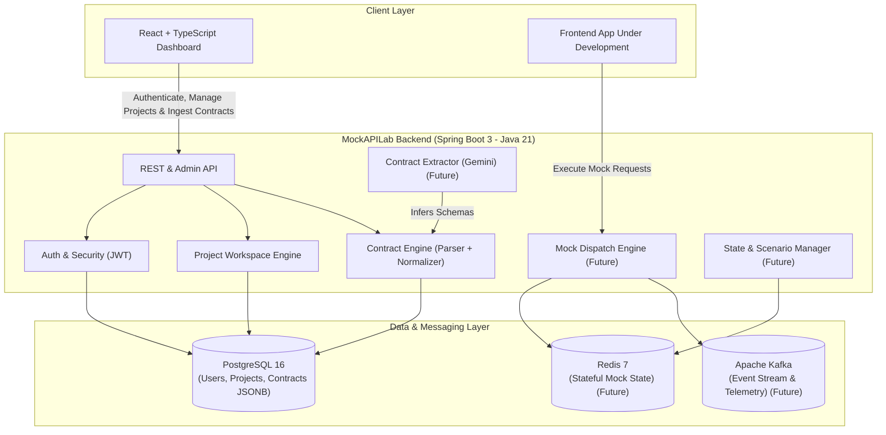

# MockAPILab — Architecture & Design Decisions

This document outlines the architectural principles, technology choices, and component responsibilities for **MockAPILab**.

---

## 1. Architectural Philosophy: Modular Monolith

MockAPILab is intentionally structured as a **Modular Monolith** rather than a distributed set of microservices.

### Why a Modular Monolith?
- **Domain Cohesion & Velocity:** At this stage of development, domain boundaries (identity, projects, contracts, state machines, scenarios, runtime dispatch) benefit from compile-time type safety, shared memory calls, and single-deployment coordination.
- **Operational Simplicity:** Avoids the overhead of service meshes, distributed tracing, network latency between internal components, and multi-service deployment synchronization.
- **Strict Boundary Enforcement:** Modules communicate via clean interfaces/DTOs within `com.mockapilab.modules.*`. When a module (e.g., dynamic runtime dispatch) warrants independent scaling in the future, its clear package boundaries make extraction straightforward.

```
com.mockapilab
├── common/             # Cross-cutting: web exceptions, API envelopes, CORS, OpenAPI configuration
└── modules/
    ├── auth/           # Identity, JWT issuance, password hashing, UserPrincipal (M2)
    ├── project/        # Workspace boundaries & owner isolation (M2)
    ├── contract/       # OpenAPI/Swagger parser, Normalized Contract Model, JSONB persistence (M3)
    ├── generation/     # Deterministic & schema-driven mock payload generators (M4)
    ├── scenario/       # Stateful workflows, sequences, and rule conditions (M4)
    ├── runtime/        # High-throughput mock HTTP request matching engine (M4)
    └── ai/             # Gemini-assisted schema ingestion & contract extraction (M5)
```

---

## 2. Technology Stack & Component Responsibilities



---

## 3. Normalized Contract Architecture (Milestone 3 Core)

### 3.1 The Canonical Normalized Model Principle
The central architectural insight of MockAPILab is that **downstream systems (mock runtime, dynamic data generator, scenario engine, contract diffing) must NOT depend on third-party OpenAPI or Swagger object models.**

Instead, all incoming API specifications—whether ingested as OpenAPI 3.x documents, extracted from backend controller source code via Gemini, or synthesized from natural language—are transformed into a unified **`NormalizedContract`**:

```
OpenAPI 3.x (JSON/YAML) ──┐
                          │
Spring/Express AST + AI ──┼──> [OpenApi / AST Parser] ──> NormalizedContract ──> JSONB Storage
                          │                                        │
Natural Language Specs ───┘                                        ├──> Dynamic Mock Engine (M4)
                                                                   ├──> Stateful Scenarios (M4)
                                                                   └──> Contract Diffing (Future)
```

### 3.2 Normalized Contract Structure
The normalized model (`com.mockapilab.modules.contract.model.normalized`) encapsulates:
- **`ContractMetadata`:** Title, description, version, canonical format version.
- **`NormalizedEndpoint`:** Path, HTTP method, summary, description, operationId, normalized parameters, request body, and response definitions.
- **`NormalizedParameter`:** Location (`PATH`, `QUERY`, `HEADER`, `COOKIE`), name, required flag, description, and schema.
- **`NormalizedRequestBody` & `NormalizedResponse`:** Status codes, descriptions, media type mappings (e.g. `application/json`), header specifications.
- **`NormalizedSchema`:** Type (`string`, `integer`, `number`, `boolean`, `array`, `object`), format (`uuid`, `email`, `date-time`, etc.), properties, required properties, array items, enum constants, nullable flags, examples, and component references (`$ref`).

### 3.3 PostgreSQL JSONB Persistence
- **Decision:** Relational metadata (IDs, foreign keys, timestamps, version numbers) are indexed in standard PostgreSQL columns, while the `NormalizedContract` is persisted as a `JSONB` document via Hibernate's `@JdbcTypeCode(SqlTypes.JSON)`.
- **Rationale:** Avoids schema churn and dozens of relational join tables for polymorphic OpenAPI structures, while providing fast indexing, deterministic document retrieval, and deep JSON querying in PostgreSQL.

### 3.4 Contract Versioning Model
- `Contract` $\rightarrow$ `1..N` `ContractVersion`.
- Every version (starting at `1`) is an **immutable snapshot** of the normalized definition with its source type (`OPENAPI`, `AI_CONTROLLER`, `NATURAL_LANGUAGE`).
- Previous versions are never mutated or overwritten.

---

## 4. Architectural Decision Records (ADRs)

### 4.1 Stateless JWT Authentication (ADR-001)
- **Decision:** Stateless HMAC-SHA256 tokens for identity and workspace authorization.
- **Rationale:** No distributed session affinity required; seamless horizontal scale-out.

### 4.2 Strong Password Hashing (ADR-002)
- **Decision:** BCrypt with salting (`BCryptPasswordEncoder`).
- **Rationale:** Protects against rainbow table and offline dictionary attacks.

### 4.3 Strict DTO Boundaries (ADR-003)
- **Decision:** All controller APIs expose and consume Java Record DTOs.
- **Rationale:** Decouples internal persistence entities and prevents mass-assignment or sensitive field leakage.

### 4.4 Server-Side Workspace & Contract Isolation (ADR-004)
- **Decision:** All project and contract queries verify project ownership on the server side (`project.owner.id == currentPrincipal.id`).
- **Rationale:** Multi-tenant workspace security; User A cannot access or create contracts in User B's projects.

### 4.5 Flyway Version-Controlled Migrations (ADR-005)
- **Decision:** Flyway scripts (`V1__...`, `V2__...`) manage all schema evolution with `hibernate.ddl-auto=validate`.
- **Rationale:** Deterministic database state across environments without non-deterministic Hibernate auto-DDL.

### 4.6 Dedicated OpenAPI Parser & Reference Resolver (ADR-006)
- **Decision:** `OpenApiContractParser` encapsulates SwaggerParser, validates OpenAPI 3.x compliance, resolves local `$ref` pointers, and isolates the rest of the application from Swagger/OpenAPI internal classes.
- **Rationale:** Protects the MockAPILab core from future upstream OpenAPI library breaking changes.

---

## 5. Architectural Invariants
1. **Determinism over Hallucination:** Runtime mock responses and data generation must strictly follow schema rules deterministically.
2. **Zero Hardcoded Secrets:** All credentials, tokens, and database secrets are externalized via environment variables.
3. **Module Independence:** Business modules communicate through designated services and DTOs without cyclic dependencies.
